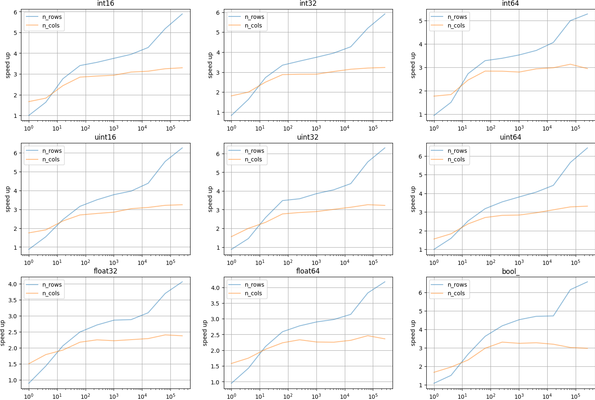
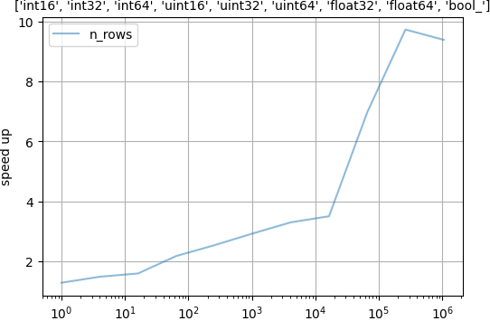

# serde-numpy

serde-numpy is a library for deserializing various formats directly into numpy arrays

## Motivation
If you've ever done something like this in your code:

```python
data = json.load(open("data.json"))

arr = np.array(data["x"])
```
then this library does it faster by using minimal array allocations and less python.

Speed ups are 1.5x - 8x times faster, depending on array sizes (and CPU), when compared to orjson + numpy.

## Installation
Currently only available for linux, python >= 3.7

```bash
pip install --upgrade pip
pip install serde-numpy
```

## Usage


The user specifies the numpy dtypes within a `structure` corresponding to the data that they want to deserialize.

### N-dimensional array

A subset of the json's (or msgpack) keys are specified in the `structure` which is used to initialize the `NumpyDeserializer` and then that subset of keys are deserialized accordingly:


```python
>>> from serde_numpy import NumpyDeserializer
>>> 
>>> json_str = b"""
... {
...     "name": "coordinates",
...     "version": "0.1.0",
...     "arr": [[1.254439975231648, -0.6893827594332794],
...             [-0.2922560025562806, 0.5204819306523419]]
... }
... """
>>> 
>>> structure = {
...     'name': str,
...     'arr': np.float32
... }
>>> 
>>> deserializer = NumpyDeserializer.from_dict(structure)
>>> 
>>> deserializer.deserialize_json(json_str)
{'arr': array([[ 1.25444   , -0.68938273],
               [-0.292256  ,  0.52048194]], dtype=float32), 
 'name': 'coordinates'}
```

### Transposed arrays

Sometimes people store data in jsons in a row-wise fashion as opposed to column-wise. Therefore each row can contain multiple dtypes. serde-numpy allows you to specify the types of each row and then deserializes into columns. To tell the numpy deserializer that you want to transpose the columns put square brackets outside either a dictionary `[{key: Type, ...}]` like this example:

```python
>>> json_str = b"""
... {
...     "df": [{"a": 3, "b": 4.23},
...            {"a": 4, "b": 5.12}]
... }
... """
>>> 
>>> structure = {"df": [{"a": np.uint16, "b": np.float64}]}
>>> 
>>> deserializer = NumpyDeserializer.from_dict(structure)
>>> 
>>> deserializer.deserialize_json(json_str)
{'df': {'b': array([4.23, 5.12]), 'a': array([3, 4], dtype=uint16)}}
```
**or** put square brackets outside a list `[[Type, ...]]` of types:

```python
>>> json_str = b"""
... {
...     "df": [["i", true],
...            ["j", false],
...            ["k", true]]
... }
... """
>>> 
>>> structure = {"df": [[str, np.bool_]]}
>>> 
>>> deserializer = NumpyDeserializer.from_dict(structure)
>>> 
>>> deserializer.deserialize_json(json_str)
{'df': [['i', 'j', 'k'], array([ True, False,  True])]}
```

### Currently supported data formats:
- `JSON` :: `NumpyDeserializer.deserialize_json`
- `MessagePack` :: `NumpyDeserializer.deserialize_msgpack`

### Currently supported types:
Numpy types:
- `np.int8`
- `np.int16`
- `np.int32`
- `np.int64`
- `np.uint8`
- `np.uint16`
- `np.uint32`
- `np.uint64`
- `np.float32`
- `np.float64`
- `np.bool_`

Python types:
- `int`
- `float`
- `str`
- `dict`
- `list`

## Benchmarks

All benchmarks were performed on an AMD Ryzen 9 3950X (Python 3.8.12, numpy 1.23.2, orjson 3.6.4). Orjson was selected as the comparison as it is the fastest on python json benchmarks and we have also found it to be fastest in practice.

### 2D Array deserialization

Two tests are performed. The number of rows are kept constant at 10 while varying the number of columns **and** the number of columns are kept constant at 10 while varying the number of rows. We compare against `orjson.loads` + `np.array` with the desired data type. Results are presented below for deserializing arrays of various data types:



### Transposed arrays deserialization

For this test we test the speed of deserializing multiple data types which have been serialized in a row-wise fashion and converting it to column-wise arrays during deserializition.

